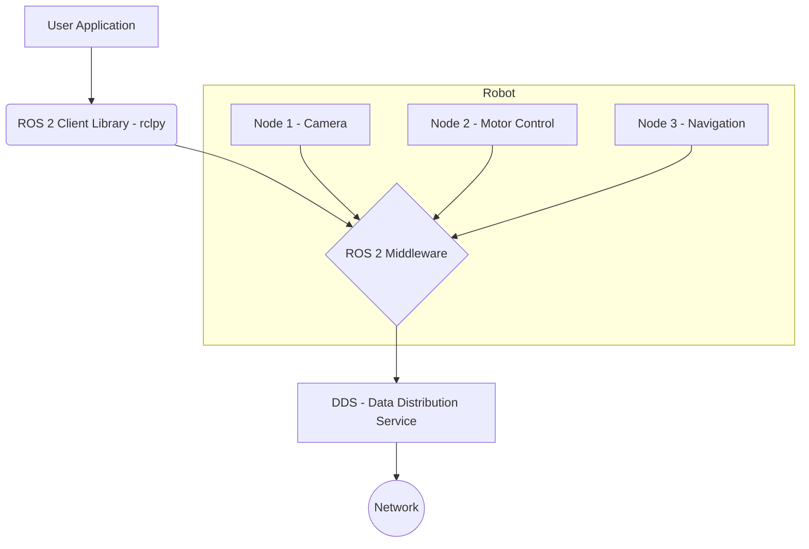

# Chapter 1: Foundations of ROS 2

Welcome to the first module of our journey into AI and Humanoid Robotics! This chapter lays the groundwork by introducing you to the Robot Operating System (ROS) 2, the nervous system of our future humanoid robot.

## What is ROS 2?

ROS 2 is an open-source, flexible framework for writing robot software. It's not an operating system in the traditional sense (like Windows or Linux), but a set of software libraries and tools that help you build robot applications. Think of it as a middleware that simplifies the task of creating complex and robust robot behavior across a wide variety of robotic platforms.

## Why Do Robots Need Middleware?

Modern robots are complex systems, often with dozens of sensors, motors, and computers running simultaneously. A middleware like ROS 2 provides a standardized way for all these components to communicate with each other. It handles the low-level details of message passing, allowing you to focus on the high-level logic of your robot's behavior.

Key benefits include:
-   **Modularity**: ROS 2 encourages you to break down complex problems into smaller, manageable nodes.
-   **Reusability**: You can easily reuse code and components from the vibrant ROS community.
-   **Language Independence**: Nodes can be written in different programming languages (we'll be using Python).

## ROS 1 vs. ROS 2

ROS 2 is a complete redesign of ROS 1, built to address the needs of modern robotics, including multi-robot systems, real-time control, and production environments. While the core concepts are similar, ROS 2 offers significant improvements in performance, reliability, and security.

## ROS 2 Architecture

Here is a simplified diagram of the ROS 2 architecture, which we will be exploring in detail in the upcoming chapters.

