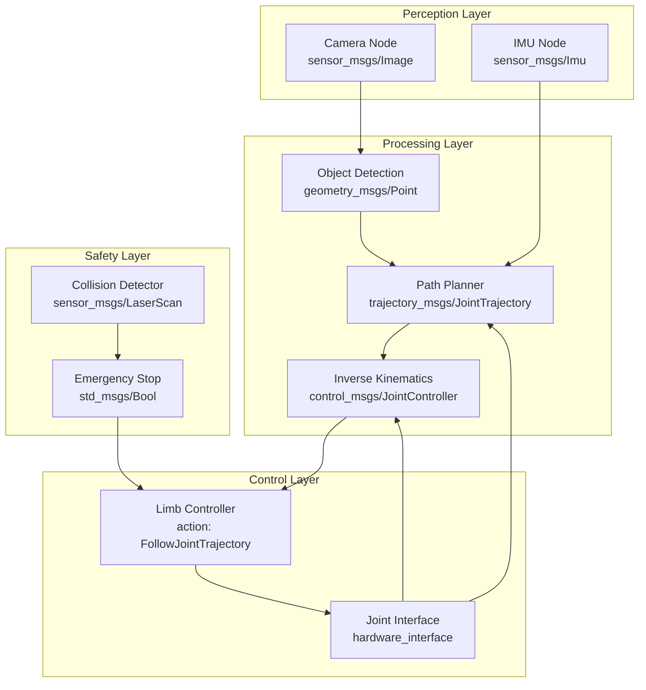

# Chapter 5 - Middleware in Action

## Introduction

In this chapter, we'll explore a real-world application of ROS 2 middleware by examining a humanoid limb control system. This demonstrates how the concepts learned in previous chapters come together in a practical scenario. We'll look at how multiple nodes communicate to coordinate complex robot movements.

## Real-world ROS 2 Communication Flow

In a humanoid robot, multiple systems need to work together seamlessly. Consider a simple reaching motion:

1. **Perception Node**: Processes camera data to identify target object location
2. **Planning Node**: Calculates the optimal path for the arm to reach the target
3. **Control Node**: Converts the planned path into joint commands
4. **Hardware Interface**: Sends commands to the physical motors
5. **Feedback Loop**: Monitors actual joint positions and reports back

This communication flow involves various ROS 2 concepts working together:

- **Topics** for continuous sensor data and feedback
- **Services** for specific requests (e.g., "calculate path to point")
- **Actions** for long-running tasks (e.g., "move arm to position" with feedback)

## Case Study: Humanoid Limb Controller

Let's examine a complete case study of a humanoid limb controller system. This system coordinates multiple joints to achieve complex movements like reaching, grasping, and manipulation.

### System Architecture

The humanoid limb controller consists of several coordinated nodes:



### Topic Flow Analysis

- `/camera/image_raw`: Camera data published at 30Hz
- `/imu/data`: Inertial measurement unit data at 100Hz
- `/detected_object`: Object position and orientation
- `/planned_trajectory`: Joint trajectory for the limb
- `/joint_commands`: Individual joint position/velocity commands
- `/joint_states`: Current joint positions, velocities, and efforts
- `/laser_scan`: Distance measurements for collision detection

### Detailed Node Descriptions

#### Object Detection Node
This node processes camera images to identify objects in the environment and calculates their 3D positions relative to the robot.

#### Path Planning Node
Based on the detected object positions and desired end-effector pose, this node calculates collision-free trajectories for the limb.

#### Inverse Kinematics Node
Converts desired end-effector poses to joint-space trajectories using kinematic models of the limb.

#### Limb Controller Node
Executes the planned trajectories using action-based interfaces, providing feedback on execution progress.

#### Joint Interface Node
Interfaces with the physical hardware, sending commands to motors and receiving feedback from encoders.

### Implementation Example

Here's how the limb controller action server might be implemented:

```python
import rclpy
from rclpy.action import ActionServer, GoalResponse
from rclpy.node import Node
from control_msgs.action import FollowJointTrajectory
from trajectory_msgs.msg import JointTrajectoryPoint
import time

class HumanoidLimbController(Node):
    def __init__(self):
        super().__init__('humanoid_limb_controller')

        # Action server for trajectory execution
        self._action_server = ActionServer(
            self,
            FollowJointTrajectory,
            'left_arm_controller/follow_joint_trajectory',
            self.execute_trajectory_callback)

        # Publishers for joint commands
        self.joint_cmd_pub = self.create_publisher(
            JointTrajectoryPoint,
            '/left_arm/joint_commands',
            10)

        # Subscribers for joint feedback
        self.joint_state_sub = self.create_subscription(
            JointTrajectoryPoint,
            '/left_arm/joint_states',
            self.joint_state_callback,
            10)

        self.current_positions = {}

    def joint_state_callback(self, msg):
        """Update current joint positions."""
        # Update internal state with current joint positions
        pass

    def execute_trajectory_callback(self, goal_handle):
        """Execute the joint trajectory goal."""
        self.get_logger().info('Executing trajectory goal...')

        feedback_msg = FollowJointTrajectory.Feedback()
        result = FollowJointTrajectory.Result()

        trajectory = goal_handle.request.trajectory
        start_time = self.get_clock().now()

        for i, point in enumerate(trajectory.points):
            # Send joint command
            self.joint_cmd_pub.publish(point)

            # Wait for the specified time
            time.sleep(0.01)  # Small delay to simulate execution

            # Update feedback
            feedback_msg.actual.positions = list(point.positions)
            feedback_msg.desired.positions = list(point.positions)
            feedback_msg.processing_point = i
            feedback_msg.error.positions = [0.0] * len(point.positions)

            goal_handle.publish_feedback(feedback_msg)

            # Check for cancellation
            if goal_handle.is_cancel_requested:
                goal_handle.canceled()
                result.error_code = result.PATH_TOLERANCE_VIOLATED
                return result

        # Check if goal was achieved
        goal_handle.succeed()
        result.error_code = result.SUCCESSFUL
        return result

def main(args=None):
    rclpy.init(args=args)
    controller = HumanoidLimbController()

    try:
        rclpy.spin(controller)
    except KeyboardInterrupt:
        pass
    finally:
        controller.destroy_node()
        rclpy.shutdown()

if __name__ == '__main__':
    main()
```

## Node Communication Patterns

### Publisher-Subscriber Pattern

The perception node subscribes to sensor data and publishes processed information:

```python
import rclpy
from rclpy.node import Node
from sensor_msgs.msg import Image
from geometry_msgs.msg import Point

class PerceptionNode(Node):
    def __init__(self):
        super().__init__('perception_node')
        self.subscription = self.create_subscription(
            Image,
            '/camera/image_raw',
            self.image_callback,
            10)
        self.publisher = self.create_publisher(
            Point,
            '/detected_object',
            10)

    def image_callback(self, msg):
        # Process image to detect object
        object_point = self.process_image(msg)
        self.publisher.publish(object_point)
```

### Service-Based Communication

For on-demand calculations, services are appropriate:

```python
import rclpy
from rclpy.node import Node
from geometry_msgs.srv import GetTransform

class TransformService(Node):
    def __init__(self):
        super().__init__('transform_service')
        self.srv = self.create_service(
            GetTransform,
            'get_transform',
            self.get_transform_callback)

    def get_transform_callback(self, request, response):
        # Calculate transform between two frames
        response.transform = self.calculate_transform(
            request.frame_from,
            request.frame_to)
        return response
```

### Action-Based Long-Running Tasks

For coordinated limb movements, actions provide the necessary feedback:

```python
import rclpy
from rclpy.action import ActionServer
from rclpy.node import Node
from control_msgs.action import FollowJointTrajectory

class ArmController(Node):
    def __init__(self):
        super().__init__('arm_controller')
        self._action_server = ActionServer(
            self,
            FollowJointTrajectory,
            'arm_controller/follow_joint_trajectory',
            self.execute_trajectory)

    def execute_trajectory(self, goal_handle):
        feedback_msg = FollowJointTrajectory.Feedback()
        result = FollowJointTrajectory.Result()

        # Execute the trajectory with feedback
        for i, point in enumerate(goal_handle.request.trajectory.points):
            # Send joint command
            self.send_joint_command(point)

            # Update feedback
            feedback_msg.actual.positions = self.get_current_positions()
            feedback_msg.processing_point = i
            goal_handle.publish_feedback(feedback_msg)

        goal_handle.succeed()
        result.error_code = result.SUCCESSFUL
        return result
```

## Safety Considerations

In a real humanoid system, safety is paramount:

- **Joint Limits**: Enforce physical limits to prevent damage
- **Velocity Limits**: Prevent dangerous movements
- **Collision Detection**: Monitor for potential collisions
- **Emergency Stop**: Implement immediate halt functionality

## Summary

This chapter demonstrated how ROS 2 middleware concepts apply to real-world robotics applications. We explored:
- Multi-node coordination patterns
- Appropriate use of topics, services, and actions
- Safety considerations in robot control
- Communication flow in a humanoid limb control system

## References

> (Quigley et al., 2009). *Programming Robots with ROS: A Practical Introduction to the Robot Operating System*. O'Reilly Media.
> (Siegwart et al., 2011). *Introduction to Autonomous Mobile Robots*. MIT Press.
> (ROS Wiki). *Middleware Concepts in ROS 2*. Robot Operating System.